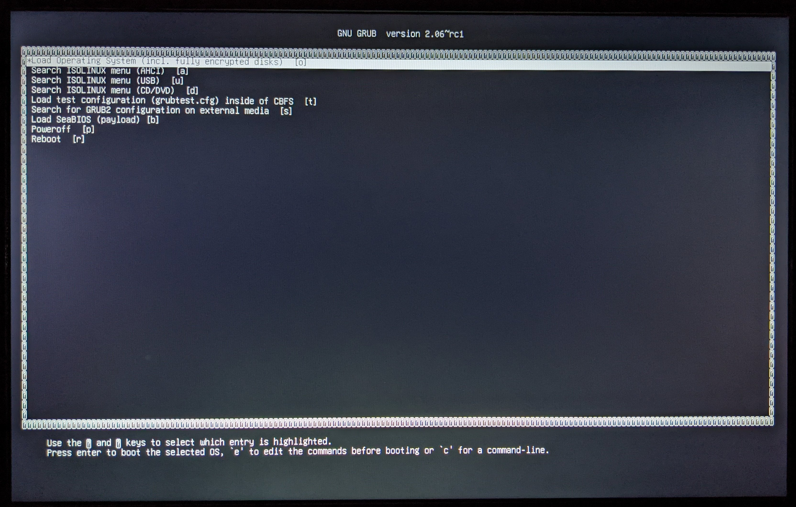
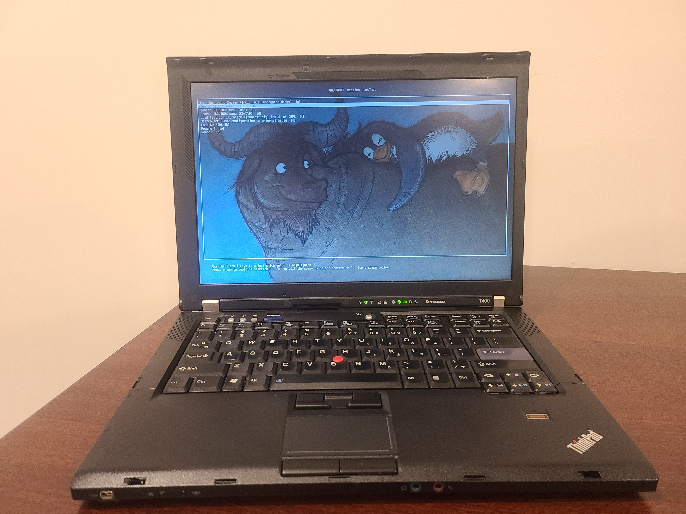
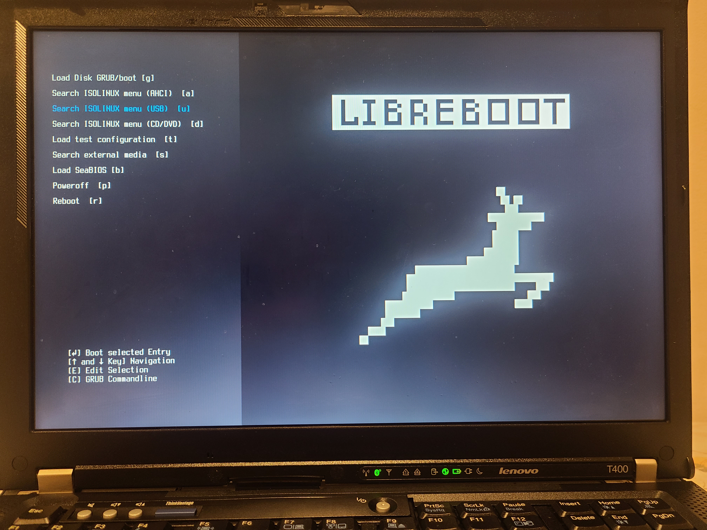

# Bleeding Libreboot Roms

This repo has a few of the bleeding edge roms I use for various Thinkpads. All the included roms are set to the usqwerty layout with the standard grub payload.

The roms are the latest builds compiled from the libreboot [git repo.](https://notabug.org/libreboot/lbmk)
The roms are additionally patched with the standard grub unicode font and the old libreboot background.
Essentially, these roms appear like the stable libreboot release from 2016 but with the new features added since then including:

+ Corebootfb graphics
+ Support for quad core cpus
+ [fixed reboot bug](https://notabug.org/libreboot/lbmk/issues/11)
+ Secondary SeaBios payload

To make your own, simply edit the files in the *custom* folder and run `./patch custom.`
By default the custom roms have:

+ Different font
+ Different background
+ Menu on the side
+ Ascii art
+ Beeps disabled

| **Examples** |
|:---------:|
| Libreboot testing release |
|  |
| **"Stock"** |
|  |
| **Custom** |
|  |

# Instructions

To simply install, download one of the archives from the releases page.
Extract and flash the correct rom for your machine using flashrom.

If you have trouble with internal flashing add `iomem=relaxed` to your kernel's cmdline.

To replicate these builds:

+ Follow the [lbmk instructions](https://libreboot.org/docs/build/)
+ Move the desired rom to the rom directory of this git repo
+ Run patch.sh *stable/custom*

Make sure you have cbfstool installed to run the patch script.
Cbfstool is included under the util directory in any libreboot release.

# Explanation 

Libreboot is open source firmware for hardware initialization.
Libreboot will only initialize hardware and then pass to a payload.
The default payload for libreboot is GRUB.
Linux does not require an actual bios, which is why linux systems can be booted directly from GRUB in libreboot without a more complex payload.
GRUB can also chainload other payloads, such as seabios and tianocore which provide the ability to boot operating systems as a normal bios.

The modifications made in this repo mainly edit the grub configuration on libreboot rom images using cbfstool.
You can see exactly which files are included in your rom image using cbfstool.
For example, to see the contents of the default images created with lbmk:

```
 > cbfstool t400_8mb_usqwerty.rom print

FMAP REGION: COREBOOT
Name                           Offset     Type           Size   Comp
cbfs master header             0x0        cbfs header        32 none
fallback/romstage              0x80       (unknown)       58136 none
fallback/ramstage              0xe440     (unknown)      110231 LZMA (242648 decompressed)
config                         0x29340    raw               476 none
revision                       0x29540    raw               711 none
build_info                     0x29840    raw               100 none
fallback/dsdt.aml              0x29900    raw             15108 none
vbt.bin                        0x2d440    raw              1412 LZMA (3863 decompressed)
cmos.default                   0x2da00    cmos_default      256 none
cmos_layout.bin                0x2db40    cmos_layout      1840 none
fallback/postcar               0x2e2c0    (unknown)       20744 none
seabios.elf                    0x33440    simple elf      61348 none
etc/ps2-keyboard-spinup        0x42440    raw                 8 none
etc/pci-optionrom-exec         0x42480    raw                 8 none
etc/optionroms-checksum        0x424c0    raw                 8 none
etc/only-load-option-roms      0x42500    raw                 8 none
vgaroms/seavgabios.bin         0x42540    raw             25600 none
fallback/payload               0x48980    simple elf     626548 none
grub.cfg                       0xe1940    raw              6627 none
grubtest.cfg                   0xe3380    raw              6615 none
(empty)                        0xe4d80    null          7364452 none
bootblock                      0x7ead00   bootblock       20640 none
```

The seabios.elf file is what grub loads when pressing <kbd>B</kbd> at the main menu.
To see the nuts and bolts, we can extract the grub configuration file from the rom to inspect it further with `cbfstool t400_8mb_usqwerty.rom extract -n grub.cfg -f grub.cfg`.
You can see how grub chainloads seabios by inspecting the extracted config.

```
> grep -A2 'seabios' grub.cfg

if [ -f (cbfsdisk)/seabios.elf ]; then
menuentry 'Load SeaBIOS (payload) [b]' --hotkey='b' {
    set root='cbfsdisk'
    chainloader /seabios.elf
}
fi
```

## Applying the Fixes

If you inspect the `grub.cfg` file from above you'll notice that it does not load any fonts, themes, or background images.
Since the rom isn't loading a font that can display the border box around text, these characters appear as '?' in the 20210522 testing release.
This issue can be fixed by adding a font to the rom image and telling grub to load it.
GRUB's default font can be found on most linux systems under `/boot/grub/fonts/unicode.pf2`
Add this font to the rom:

`cbfstool t400_8mb_usqwerty.rom add -f unicode.pf2 -n unicode.pf2 -t raw`

Then place `loadfont (cbfsdisk)/unicode.pf2` near the top of the grub config.
You can then remove the old grub config and replace it with the new one.

```
> cbfstool t400_8mb_usqwerty.rom remove -n grub.cfg
> cbfstool t400_8mb_usqwerty.rom add -f grub.cfg -n grub.cfg -t raw
```

## Creating a Theme

Grub itself supports some pretty extensive theming.
To create a grub theme, simply create `theme.txt` file and source it in the grub config `set theme=(cbfsdisk)/theme.txt`.
After creating your theme, add the theme file, grub.cfg, and all fonts and backgrounds to the rom file with cbfstool.

The theme file can set all kinds of options such as the size and position of the boot menu, optional text, and background image.
To get an idea of how to write a theme file, see the theme.txt file in this repo under the `custom` directory.
